# CRUD Operations with FastAPI: A Detailed Guide
This guide provides a detailed walkthrough for implementing CRUD (Create, Read, Update, Delete) operations using FastAPI. CRUD operations are fundamental in API development, enabling basic data manipulation. In this project, you will read each of these operations in detail.

# Introduction
In this project, we will use FastAPI to implement CRUD operations. CRUD stands for Create, Read, Update, and Delete, which correspond to the HTTP methods POST, GET, PUT, and DELETE, respectively. These operations will be applied to a collection of books, serving as our dummy data for demonstration purposes. Let's start by importing the necessary libraries.

# Import Libraries
First, we need to import the FastAPI and Body classes from the fastapi library. The Body class will be used to define request bodies for our POST and PUT methods.

```from fastapi import Body, FastAPI```

# Initialize the FastAPI Application
Next, we initialize the FastAPI application. This creates an instance of the FastAPI class, which we will use to define our API routes.

```app = FastAPI()```
# Dummy Data
For this example, we'll create a list of dictionaries to represent our book collection. Each dictionary contains information about a book, such as its title, author, and category.

```
BOOKS = [
    {'title': 'Title One', 'author': 'Author One', 'category': 'science'},
    {'title': 'Title Two', 'author': 'Author Two', 'category': 'science'},
    {'title': 'Title Three', 'author': 'Author Three', 'category': 'history'},
    {'title': 'Title Four', 'author': 'Author Four', 'category': 'math'},
    {'title': 'Title Five', 'author': 'Author Five', 'category': 'math'},
    {'title': 'Title Six', 'author': 'Author Two', 'category': 'math'}
]
```

# The read_all_books Endpoint
The read_all_books endpoint is designed to return the entire list of books in our collection. It is defined as an asynchronous function to leverage FastAPI's ability to handle asynchronous I/O operations, which can improve performance in applications with high concurrency.

```
@app.get("/books")
async def read_all_books():
    return BOOKS
```

- HTTP Method: GET
- Path: /books
- Description: This endpoint retrieves all the books in the BOOKS list.
- Response: It returns the entire BOOKS list in JSON format.
# Advantages of Asynchronous Endpoints
Using the async keyword in FastAPI endpoints allows for better handling of concurrent requests. This is particularly useful when dealing with I/O-bound operations, such as database queries or API calls, making the application more efficient under heavy load.
# Testing the Endpoint with Swagger UI
FastAPI includes an interactive API documentation interface powered by Swagger UI, which makes it easy to test and interact with the API endpoints.

# Accessing Swagger UI
Start the FastAPI Application:
Run your FastAPI application. By default, FastAPI will serve the application at http://127.0.0.1:8000.
```
uvicorn book:app --reload
```

# Open Swagger UI:

Navigate to http://127.0.0.1:8000/docs in your web browser. This URL opens the Swagger UI, where you can see all the available endpoints and interact with them.
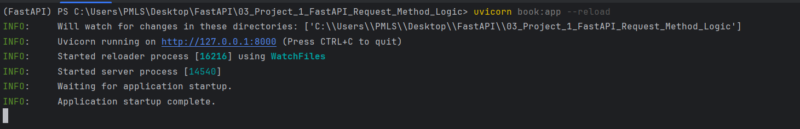
# Using Swagger UI to Test the read_all_books Endpoint
- **Locate the GET /books Endpoint**:
In the Swagger UI, find the section for the GET /books endpoint. It should be listed among other endpoints defined in your FastAPI application.
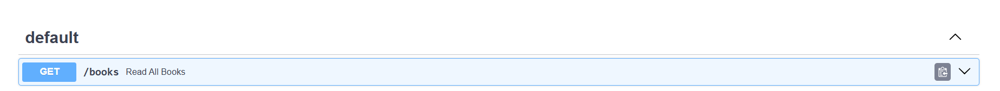
- **Expand the Endpoint**:
Click on the GET /books endpoint to expand it. You will see a "Try it out" button and a description of the endpoint.

- **Test the Endpoint**:
Click the "Try it out" button. Then, click the "Execute" button. Swagger UI will send a request to the GET /books endpoint and display the response.

- **View the Response**:
After executing the request, you will see the response data. This includes the status code and the JSON response containing the list of books.
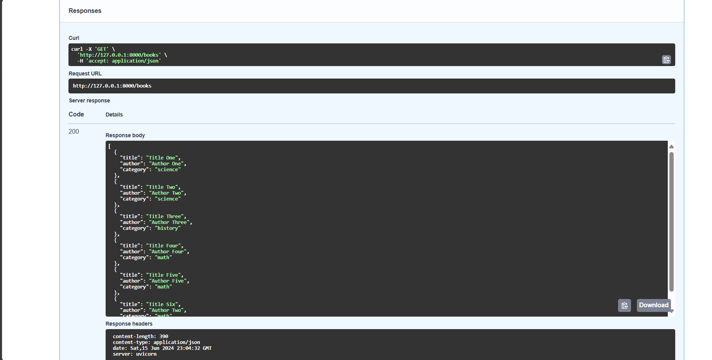


# The read_book Endpoint
The read_book endpoint allows users to retrieve a specific book from the collection based on the book's title. This endpoint demonstrates the use of path parameters in FastAPI, enabling dynamic URL paths that can accept user input.
```
@app.get("/books/{book_title}")
async def read_book(book_title: str):
    for book in BOOKS:
        if book.get('title').casefold() == book_title.casefold():
            return book
```

- **HTTP Method**: GET
- **Path**: /books/{book_title}
- **Path Parameter**: {book_title} is a path parameter that takes the title of the book as input.
- **Description**: This endpoint searches the BOOKS list for a book with a title that matches book_title, ignoring case.
- **Response**: If a match is found, it returns the book details as a JSON object. If no match is found, it returns None.
# Path Parameters
Path parameters are variables within the URL path that are used to capture user input. In this case, book_title is a path parameter that captures the title of the book from the URL and passes it to the read_book function.

# Accessing Swagger UI
- Start the FastAPI Application:
Run your FastAPI application. By default, FastAPI will serve the application at http://127.0.0.1:8000.

# Using Swagger UI to Test the read_book Endpoint
### Locate the GET /books/{book_title} Endpoint:
In the Swagger UI, find the section for the GET /books/{book_title} endpoint. It should be listed among other endpoints defined in your FastAPI application.
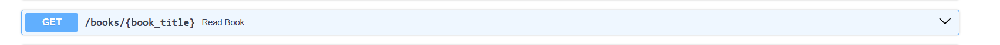
### Expand the Endpoint:
Click on the GET /books/{book_title} endpoint to expand it. You will see a "Try it out" button and a field to input the book_title.
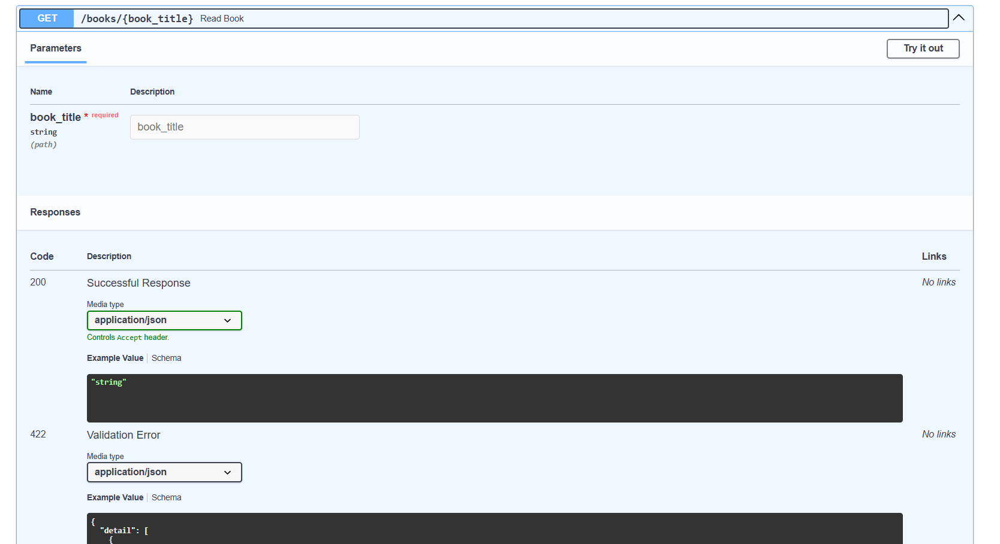

### Test the Endpoint:
Click the "Try it out" button. Enter the title of the book you want to search for in the book_title field. Then, click the "Execute" button. Swagger UI will send a request to the GET /books/{book_title} endpoint and display the response.
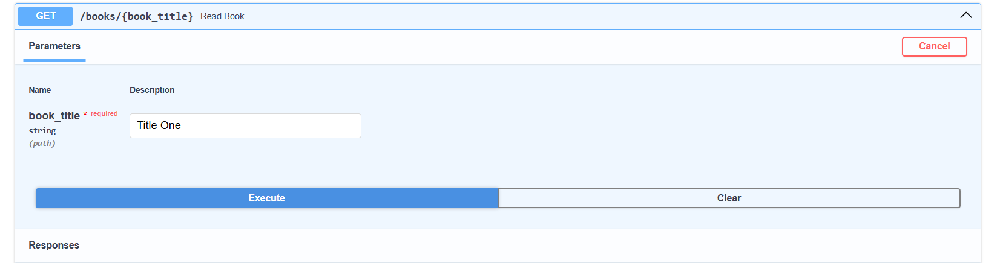

### View the Response:
After executing the request, you will see the response data. This includes the status code and the JSON response containing the details of the book, if found.

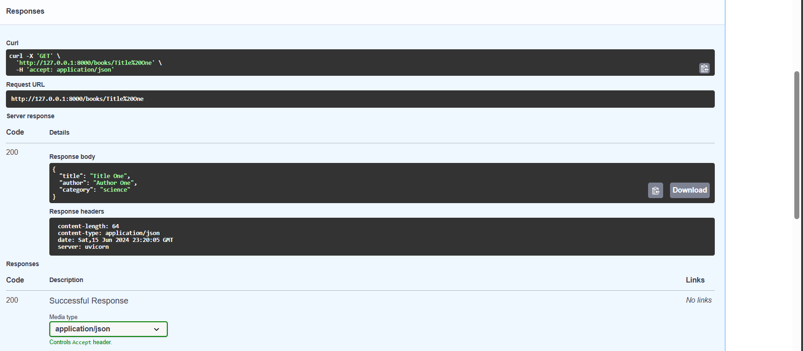
### Example Response
If the book with the title "**Title One**" exists in the BOOKS list, the response might look like this:

```
{
    "title": "Title One",
    "author": "Author One",
    "category": "science"
}
```

# The read_category_by_query Endpoint
The read_category_by_query endpoint allows users to retrieve books from the collection based on their category. This endpoint demonstrates the use of query parameters in FastAPI, enabling users to filter results by providing specific query parameters.
```
@app.get("/books/")
async def read_category_by_query(category: str):
    book_to_return = []
    for book in BOOKS:
        if book.get("category").casefold() == category.casefold():
            book_to_return.append(book)
    return book_to_return
   ```
- **HTTP Method**: GET
- **Path**: /books/
- **Query Parameter**: category is a query parameter that takes the category of the books as input.
- **Description**: This endpoint searches the BOOKS list for books with a category that matches category, ignoring case.
- **Response**: It returns a list of books in the specified category as a JSON array.

# Query Parameters
Query parameters are specified in the URL after the ? symbol and are typically used to filter or sort data. In this case, category is a query parameter used to filter books by their category.
```http://127.0.0.1:8000/books/?category=science```

# Using Swagger UI to Test the read_category_by_query Endpoint
### Locate the GET /books/ Endpoint:
In the Swagger UI, find the section for the GET /books/ endpoint. It should be listed among other endpoints defined in your FastAPI application.

# Expand the Endpoint:
Click on the GET /books/ endpoint to expand it. You will see a "Try it out" button and a field to input the category query parameter.
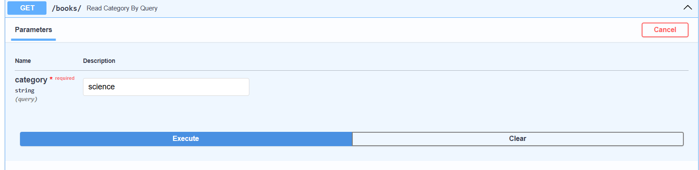

# Test the Endpoint:
Click the "Try it out" button. Enter the category you want to search for in the category field. Then, click the "Execute" button. Swagger UI will send a request to the GET /books/ endpoint with the specified query parameter and display the response.
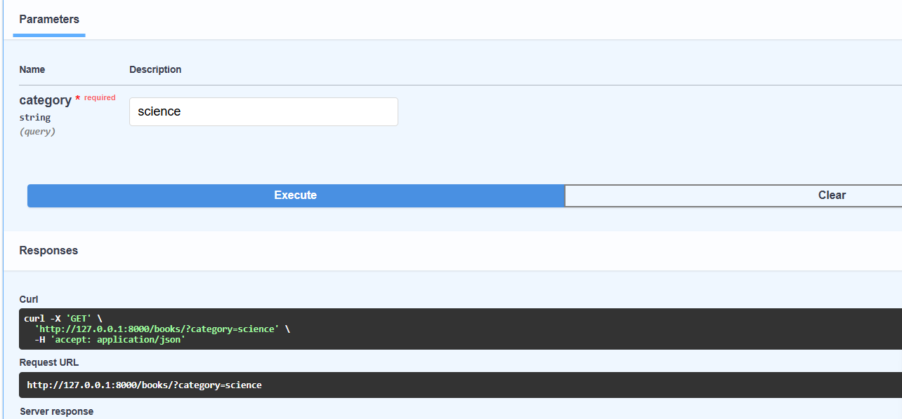

# View the Response:
After executing the request, you will see the response data. This includes the status code and the JSON response containing the list of books that match the specified category.
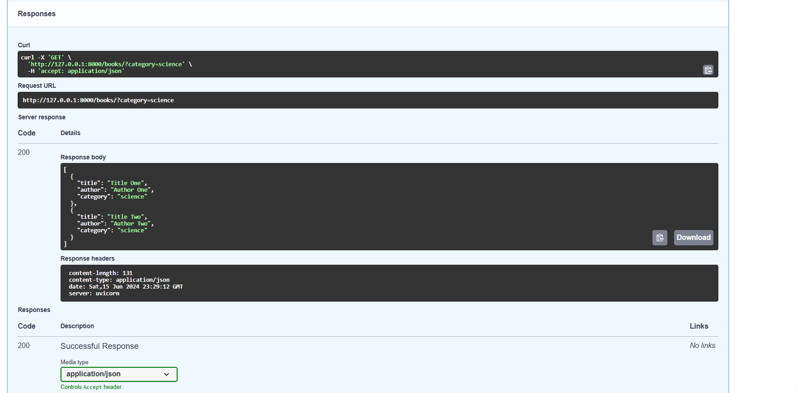

## The read_author_category_by_query Endpoint
The read_author_category_by_query endpoint allows users to retrieve books from the collection based on both the author's name and the book's category. This endpoint demonstrates the combined use of **path** and **query parameters** in FastAPI, enabling more specific and dynamic URL paths that can accept user input.

```
@app.get("/books/{book_author}")
async def read_author_category_by_query(book_author: str, category: str):
    book_to_return = []
    for book in BOOKS:
        if book.get("author").casefold() == book_author.casefold() and \
           book.get("category").casefold() == category.casefold():
            book_to_return.append(book)
    return book_to_return

```
- **HTTP Method**: GET
- **Path**: /books/{book_author}
- **Path Parameter**: {book_author} is a path parameter that takes the author's name as input.
- **Query Parameter**: category is a query parameter that takes the category of the books as input.
- **Description**: This endpoint searches the BOOKS list for books with an author that matches book_author and a category that matches category, both ignoring case.
- **Response**: It returns a list of books that match both the author and category as a JSON array.


# Path and Query Parameters
## Path Parameters
Path parameters are variables within the URL path. In this case, book_author captures the author's name from the URL and passes it to the read_author_category_by_query function.
## Query Parameters
Query parameters are specified in the URL after the ? symbol. In this case, category is a query parameter used to filter books by their category.


# Using Swagger UI to Test the read_author_category_by_query Endpoint
## Locate the GET /books/{book_author} Endpoint:
In the Swagger UI, find the section for the GET /books/{book_author} endpoint. It should be listed among other endpoints defined in your FastAPI application.

## Expand the Endpoint:
Click on the GET /books/{book_author} endpoint to expand it. You will see a "Try it out" button and fields to input the book_author path parameter and the category query parameter.
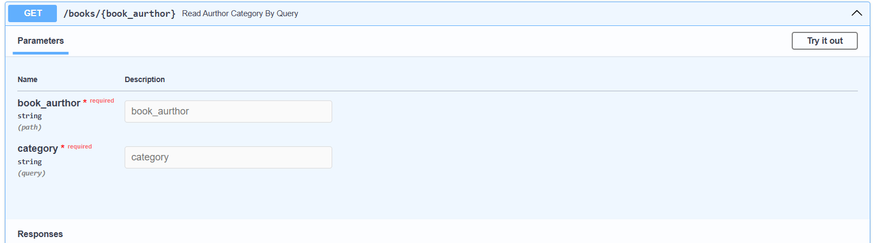

## Test the Endpoint:
Click the "Try it out" button. Enter the author's name in the book_author field and the category in the category field. Then, click the "Execute" button. Swagger UI will send a request to the GET /books/{book_author} endpoint with the specified path and query parameters and display the response.
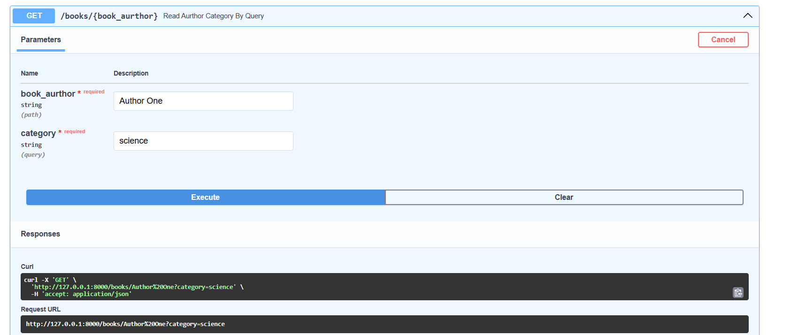

## View the Response:
After executing the request, you will see the response data. This includes the status code and the JSON response containing the list of books that match both the specified author and category.
```[
    {
        "title": "Title Six",
        "author": "Author Two",
        "category": "math"
    }
]
```

