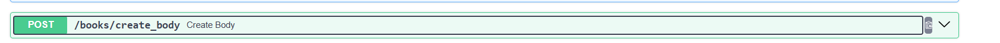
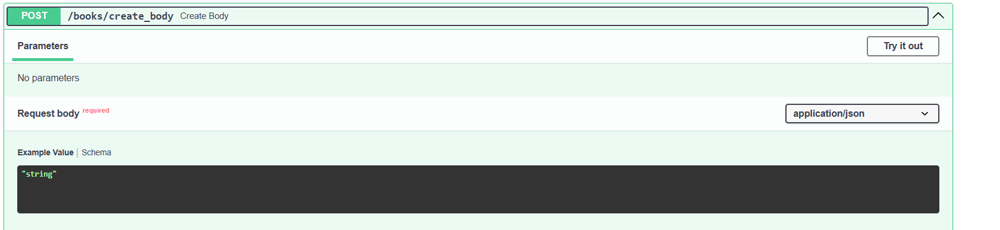
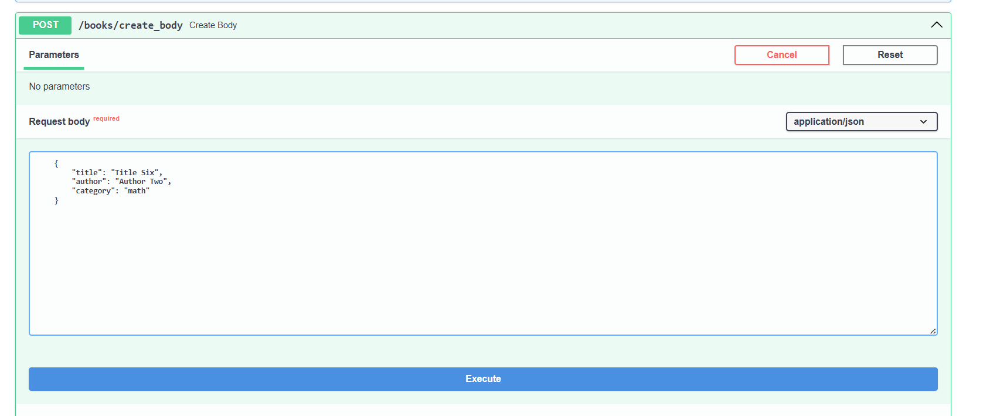
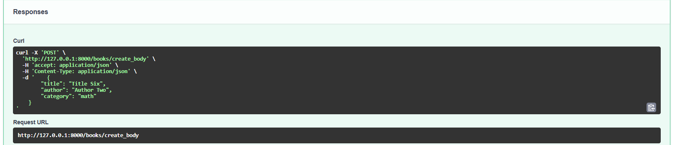
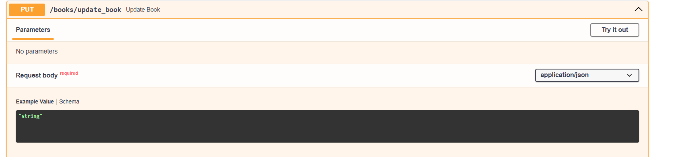
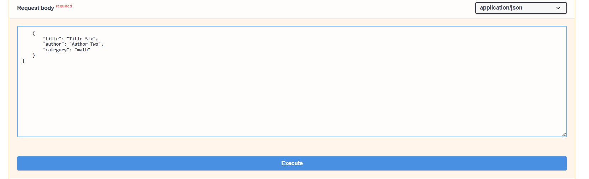
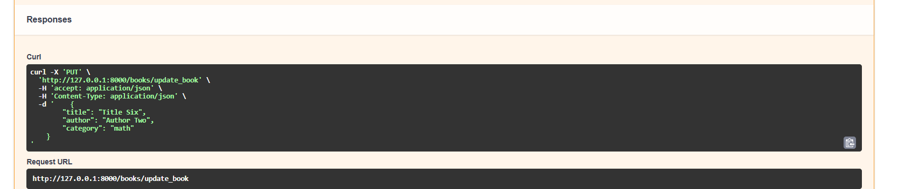

# CRUD Operations with FastAPI: A Detailed Guide
This guide provides a detailed walkthrough for implementing CRUD (Create, Read, Update, Delete) operations using FastAPI. CRUD operations are fundamental in API development, enabling basic data manipulation. In this project, you will read each of these operations in detail.

# Introduction
In this project, we will use FastAPI to implement CRUD operations. CRUD stands for Create, Read, Update, and Delete, which correspond to the HTTP methods POST, GET, PUT, and DELETE, respectively. These operations will be applied to a collection of books, serving as our dummy data for demonstration purposes. Let's start by importing the necessary libraries.

# Import Libraries
First, we need to import the FastAPI and Body classes from the fastapi library. The Body class will be used to define request bodies for our POST and PUT methods.

```from fastapi import Body, FastAPI```

# Initialize the FastAPI Application
Next, we initialize the FastAPI application. This creates an instance of the FastAPI class, which we will use to define our API routes.

```app = FastAPI()```
# Dummy Data
For this example, we'll create a list of dictionaries to represent our book collection. Each dictionary contains information about a book, such as its title, author, and category.

```
BOOKS = [
    {'title': 'Title One', 'author': 'Author One', 'category': 'science'},
    {'title': 'Title Two', 'author': 'Author Two', 'category': 'science'},
    {'title': 'Title Three', 'author': 'Author Three', 'category': 'history'},
    {'title': 'Title Four', 'author': 'Author Four', 'category': 'math'},
    {'title': 'Title Five', 'author': 'Author Five', 'category': 'math'},
    {'title': 'Title Six', 'author': 'Author Two', 'category': 'math'}
]
```

# The read_all_books Endpoint
The read_all_books endpoint is designed to return the entire list of books in our collection. It is defined as an asynchronous function to leverage FastAPI's ability to handle asynchronous I/O operations, which can improve performance in applications with high concurrency.

```
@app.get("/books")
async def read_all_books():
    return BOOKS
```

- HTTP Method: GET
- Path: /books
- Description: This endpoint retrieves all the books in the BOOKS list.
- Response: It returns the entire BOOKS list in JSON format.
# Advantages of Asynchronous Endpoints
Using the async keyword in FastAPI endpoints allows for better handling of concurrent requests. This is particularly useful when dealing with I/O-bound operations, such as database queries or API calls, making the application more efficient under heavy load.
# Testing the Endpoint with Swagger UI
FastAPI includes an interactive API documentation interface powered by Swagger UI, which makes it easy to test and interact with the API endpoints.

# Accessing Swagger UI
Start the FastAPI Application:
Run your FastAPI application. By default, FastAPI will serve the application at http://127.0.0.1:8000.
```
uvicorn book:app --reload
```

# Open Swagger UI:

Navigate to http://127.0.0.1:8000/docs in your web browser. This URL opens the Swagger UI, where you can see all the available endpoints and interact with them.

# Using Swagger UI to Test the read_all_books Endpoint
- **Locate the GET /books Endpoint**:
In the Swagger UI, find the section for the GET /books endpoint. It should be listed among other endpoints defined in your FastAPI application.

- **Expand the Endpoint**:
Click on the GET /books endpoint to expand it. You will see a "Try it out" button and a description of the endpoint.

- **Test the Endpoint**:
Click the "Try it out" button. Then, click the "Execute" button. Swagger UI will send a request to the GET /books endpoint and display the response.

- **View the Response**:
After executing the request, you will see the response data. This includes the status code and the JSON response containing the list of books.


# 01_The read_book Endpoint
The read_book endpoint allows users to retrieve a specific book from the collection based on the book's title. This endpoint demonstrates the use of path parameters in FastAPI, enabling dynamic URL paths that can accept user input.
```
@app.get("/books/{book_title}")
async def read_book(book_title: str):
    for book in BOOKS:
        if book.get('title').casefold() == book_title.casefold():
            return book
```

- **HTTP Method**: GET
- **Path**: /books/{book_title}
- **Path Parameter**: {book_title} is a path parameter that takes the title of the book as input.
- **Description**: This endpoint searches the BOOKS list for a book with a title that matches book_title, ignoring case.
- **Response**: If a match is found, it returns the book details as a JSON object. If no match is found, it returns None.
# Path Parameters
Path parameters are variables within the URL path that are used to capture user input. In this case, book_title is a path parameter that captures the title of the book from the URL and passes it to the read_book function.

# Accessing Swagger UI
- Start the FastAPI Application:
Run your FastAPI application. By default, FastAPI will serve the application at http://127.0.0.1:8000.

# Using Swagger UI to Test the read_book Endpoint
### Locate the GET /books/{book_title} Endpoint:
In the Swagger UI, find the section for the GET /books/{book_title} endpoint. It should be listed among other endpoints defined in your FastAPI application.

### Expand the Endpoint:
Click on the GET /books/{book_title} endpoint to expand it. You will see a "Try it out" button and a field to input the book_title.


### Test the Endpoint:
Click the "Try it out" button. Enter the title of the book you want to search for in the book_title field. Then, click the "Execute" button. Swagger UI will send a request to the GET /books/{book_title} endpoint and display the response.


### View the Response:
After executing the request, you will see the response data. This includes the status code and the JSON response containing the details of the book, if found.


### Example Response
If the book with the title "**Title One**" exists in the BOOKS list, the response might look like this:

```
{
    "title": "Title One",
    "author": "Author One",
    "category": "science"
}
```

# 02_The read_category_by_query Endpoint
The read_category_by_query endpoint allows users to retrieve books from the collection based on their category. This endpoint demonstrates the use of query parameters in FastAPI, enabling users to filter results by providing specific query parameters.
```
@app.get("/books/")
async def read_category_by_query(category: str):
    book_to_return = []
    for book in BOOKS:
        if book.get("category").casefold() == category.casefold():
            book_to_return.append(book)
    return book_to_return
   ```
- **HTTP Method**: GET
- **Path**: /books/
- **Query Parameter**: category is a query parameter that takes the category of the books as input.
- **Description**: This endpoint searches the BOOKS list for books with a category that matches category, ignoring case.
- **Response**: It returns a list of books in the specified category as a JSON array.

# 03_Query Parameters
Query parameters are specified in the URL after the ? symbol and are typically used to filter or sort data. In this case, category is a query parameter used to filter books by their category.
```http://127.0.0.1:8000/books/?category=science```

# Using Swagger UI to Test the read_category_by_query Endpoint
### Locate the GET /books/ Endpoint:
In the Swagger UI, find the section for the GET /books/ endpoint. It should be listed among other endpoints defined in your FastAPI application.

# Expand the Endpoint:
Click on the GET /books/ endpoint to expand it. You will see a "Try it out" button and a field to input the category query parameter.


# Test the Endpoint:
Click the "Try it out" button. Enter the category you want to search for in the category field. Then, click the "Execute" button. Swagger UI will send a request to the GET /books/ endpoint with the specified query parameter and display the response.


# View the Response:
After executing the request, you will see the response data. This includes the status code and the JSON response containing the list of books that match the specified category.


## The read_author_category_by_query Endpoint
The read_author_category_by_query endpoint allows users to retrieve books from the collection based on both the author's name and the book's category. This endpoint demonstrates the combined use of **path** and **query parameters** in FastAPI, enabling more specific and dynamic URL paths that can accept user input.

```
@app.get("/books/{book_author}")
async def read_author_category_by_query(book_author: str, category: str):
    book_to_return = []
    for book in BOOKS:
        if book.get("author").casefold() == book_author.casefold() and \
           book.get("category").casefold() == category.casefold():
            book_to_return.append(book)
    return book_to_return

```
- **HTTP Method**: GET
- **Path**: /books/{book_author}
- **Path Parameter**: {book_author} is a path parameter that takes the author's name as input.
- **Query Parameter**: category is a query parameter that takes the category of the books as input.
- **Description**: This endpoint searches the BOOKS list for books with an author that matches book_author and a category that matches category, both ignoring case.
- **Response**: It returns a list of books that match both the author and category as a JSON array.


# 04_Path and Query Parameters
## Path Parameters
Path parameters are variables within the URL path. In this case, book_author captures the author's name from the URL and passes it to the read_author_category_by_query function.
## Query Parameters
Query parameters are specified in the URL after the ? symbol. In this case, category is a query parameter used to filter books by their category.


# Using Swagger UI to Test the read_author_category_by_query Endpoint
## Locate the GET /books/{book_author} Endpoint:
In the Swagger UI, find the section for the GET /books/{book_author} endpoint. It should be listed among other endpoints defined in your FastAPI application.

## Expand the Endpoint:
Click on the GET /books/{book_author} endpoint to expand it. You will see a "Try it out" button and fields to input the book_author path parameter and the category query parameter.


## Test the Endpoint:
Click the "Try it out" button. Enter the author's name in the book_author field and the category in the category field. Then, click the "Execute" button. Swagger UI will send a request to the GET /books/{book_author} endpoint with the specified path and query parameters and display the response.


## View the Response:
After executing the request, you will see the response data. This includes the status code and the JSON response containing the list of books that match both the specified author and category.
```[
    {
        "title": "Title Six",
        "author": "Author Two",
        "category": "math"
    }
]
```

# 05_The create_body Endpoint
The create_body endpoint is used to add a new book to the BOOKS collection using the **POST** method. It demonstrates how to handle request bodies with the **Body** dependency in FastAPI, allowing clients to send JSON data representing the new book to be added.

```
@app.post("/books/create_body")
async def create_body(new_book: dict = Body(...)):
    BOOKS.append(new_book)
    return new_book
```

- **HTTP Method**: POST
- **Path**: /books/create_body
- **Request Body**: The new_book parameter is decorated with Body(...), indicating that this endpoint expects a JSON body in the request. The ... indicates that the body is required.
- **Description**: This endpoint adds a new book (provided in the request body) to the BOOKS list.
- **Response**: It returns the newly added book as a JSON object.

# Using the Body Dependency
The Body dependency in FastAPI allows you to specify the structure and requirements of the request body. In this case, new_book: dict = Body(...) indicates that the request body must be a JSON object (dictionary) containing data about the new book.

# Using Swagger UI to Test the create_body Endpoint
## Locate the POST /books/create_body Endpoint:
In the Swagger UI, find the section for the POST /books/create_body endpoint. It should be listed among other endpoints defined in your FastAPI application.

## Expand the Endpoint:
Click on the POST /books/create_body endpoint to expand it. You will see a "Try it out" button and a field to input the request body (new_book).



## Test the Endpoint:
Click the "Try it out" button. Enter the details of the new book in the new_book field. Then, click the "Execute" button. Swagger UI will send a POST request to the POST /books/create_body endpoint with the provided request body and display the response.

## View the Response:
After executing the request, you will see the response data. This includes the status code and the JSON response containing the details of the newly added book.


# 06_The update_book Endpoint
The update_book endpoint is designed to update an existing book in the BOOKS collection using the PUT method. It demonstrates how to handle request bodies with the Body dependency in FastAPI, allowing clients to send JSON data representing the updated book details.
```chatinput
from fastapi import Body

@app.put("/books/update_book")
async def update_book(update_book: dict = Body(...)):
    for i in range(len(BOOKS)):
        if BOOKS[i].get("title").casefold() == update_book.get("title").casefold():
            BOOKS[i] = update_book
            return {"message": "Book updated successfully"}
    return {"error": "Book not found"}

```
- **HTTP Method**: PUT
- **Path**: /books/update_book
- **Request Body**: The update_book parameter is decorated with Body(...), indicating that this endpoint expects a JSON body in the request. The ... indicates that the body is required.
**Description**: This endpoint updates an existing book in the BOOKS list. It searches for a book with a title that matches update_book['title'] (ignoring case) and replaces it with update_book.
### Response:
- If the book is found and updated, it returns a JSON response with a success message.
- If the book is not found, it returns a JSON response with an error message indicating that the book was not found.


# Swagger UI to Test the update_book Endpoint
## Locate the PUT /books/update_book Endpoint:
In the Swagger UI, find the section for the PUT /books/update_book endpoint. It should be listed among other endpoints defined in your FastAPI application.

## Expand the Endpoint:
Click on the PUT /books/update_book endpoint to expand it. You will see a "Try it out" button and a field to input the request body (update_book).


## Test the Endpoint:
Click the "Try it out" button. Enter the details of the book you want to update in the update_book field. Then, click the "Execute" button. Swagger UI will send a PUT request to the PUT /books/update_book endpoint with the provided request body and display the response.


## View the Response:
After executing the request, you will see the response data. This includes the status code and a JSON response indicating whether the book was successfully updated or if it was not found.


# 07_The delete_book Endpoint
The delete_book endpoint is used to remove a book from the BOOKS collection based on its title using the DELETE method. This endpoint showcases how to handle path parameters for deletion operations in FastAPI.
```chatinput
@app.delete("/books/delete_book/{book_title}")
async def delete_book(book_title: str):
    for i in range(len(BOOKS)):
        if BOOKS[i].get("title").casefold() == book_title.casefold():
            BOOKS.pop(i)
            return {"message": f"Book '{book_title}' deleted successfully"}
    return {"error": "Book not found"}

```
- **HTTP Method**: DELETE
- **Path**: /books/delete_book/{book_title}
- **Path Parameter**: {book_title} is a path parameter that captures the title of the book to be deleted from the URL.
- **Description**: This endpoint searches the BOOKS list for a book with a title that matches book_title (ignoring case) and removes it from the list.
### Response:
- If the book is found and successfully deleted, it returns a JSON response with a success message.
- If the book is not found, it returns a JSON response with an error message indicating that the book was not found.

## Handling the Deletion
The endpoint iterates over the BOOKS list to find the book matching book_title.
If a match is found ```(BOOKS[i].get("title").casefold() == book_title.casefold())```, it removes the book using ```BOOKS.pop(i)``` and immediately returns a success message.
It uses casefold() to perform a case-insensitive comparison to ensure robustness in matching book titles.

# Using Swagger UI to Test the delete_book Endpoint
### Locate the DELETE /books/delete_book/{book_title} Endpoint:
In the Swagger UI, find the section for the DELETE /books/delete_book/{book_title} endpoint. It should be listed among other endpoints defined in your FastAPI application.

### Expand the Endpoint:
Click on the DELETE /books/delete_book/{book_title} endpoint to expand it. You will see a "Try it out" button and a field to input the book_title path parameter.


### Test the Endpoint:
Click the "Try it out" button. Enter the title of the book you want to delete in the book_title field. Then, click the "Execute" button. Swagger UI will send a DELETE request to the DELETE /books/delete_book/{book_title} endpoint with the specified book title and display the response.


### View the Response:
After executing the request, you will see the response data. This includes the status code and a JSON response indicating whether the book was successfully deleted or if it was not found.


### Example Response
If a book titled **"Title One"** exists in the BOOKS list and is successfully deleted, the response might look like this:

```
{
    "message": "Book 'Title One' deleted successfully"
}
```
If "Title One" does not exist in the BOOKS list, the response might look like this:

```
{
    "error": "Book not found"
}
```


**The Books API powered by FastAPI offers a robust solution for managing book data with CRUD operations. Whether you're retrieving a comprehensive list of books, updating existing entries, adding new titles, or removing entries from the collection, the API provides intuitive endpoints that are easy to integrate and interact with. Each operation is supported by clear documentation, ensuring developers can efficiently utilize and extend the functionality of the API as needed. With its efficient handling of HTTP methods and meticulous error handling, the Books API in FastAPI stands out as a reliable tool for building modern web applications that require seamless data management capabilities.**

